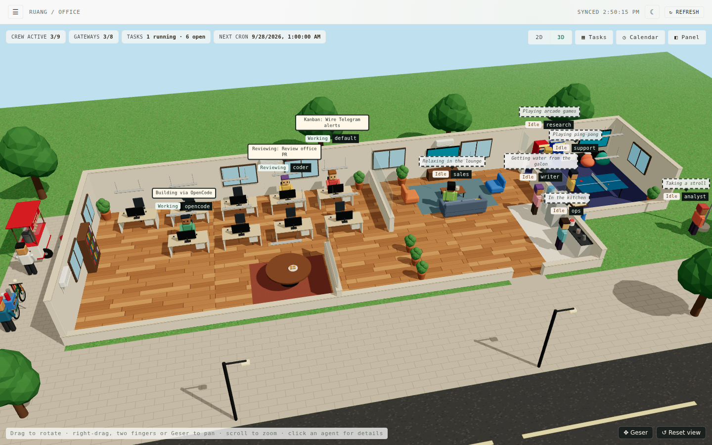
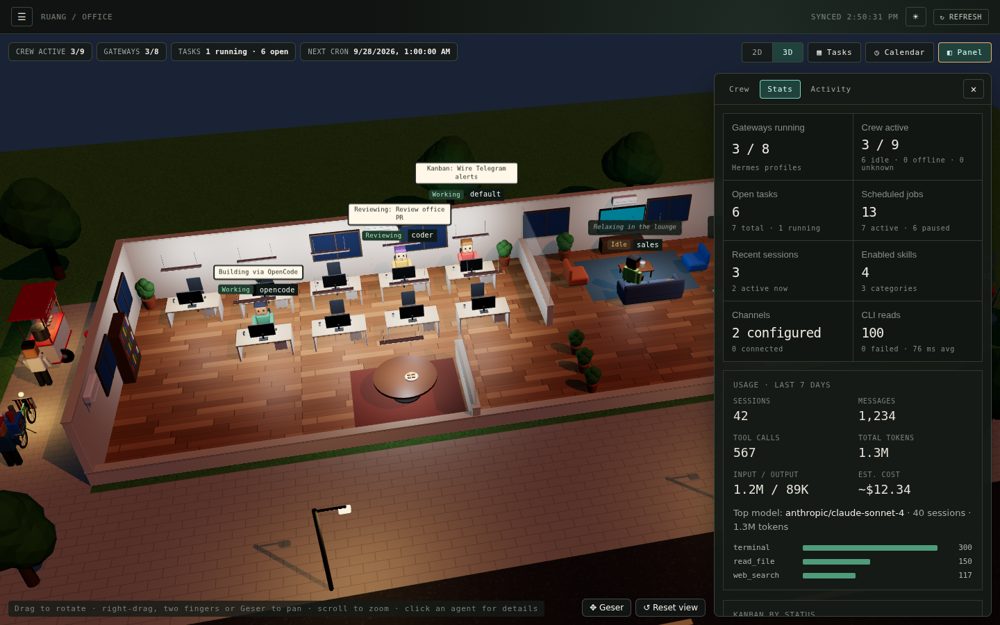

# Ruang · Hermes 3D Virtual Office

*Ruang* is Indonesian for "room" or "space". It is a 3D virtual office and read-only mission control for your local [Hermes Agent](https://hermes-agent.nousresearch.com) and OpenCode crew. See who is working and what they are doing, plus the Kanban board, cron jobs, sessions, memory, folders and logs, all in one place. Everything is read through the `hermes` CLI, and nothing is ever changed.





## Install

Works on macOS, Linux and Windows through WSL2. You need the Hermes Agent CLI (`hermes`) installed; `opencode` is optional. The installer downloads its own Node.js if you do not have Node.js 20 or newer.

```bash
curl -fsSL https://raw.githubusercontent.com/yugienugraha/ruang/main/install.sh | bash
```

Then start it and open http://127.0.0.1:3001:

```bash
ruang                        # or: ruang --port 3005
```

- **Run it in the background, and at boot (Linux):** add `--service` to install a systemd user service:
  `curl -fsSL https://raw.githubusercontent.com/yugienugraha/ruang/main/install.sh | bash -s -- --service`
  To keep it running after you log out, also run `loginctl enable-linger $USER`.
- **Update:** run the install command again.
- **Remove:** add `--uninstall` (`... | bash -s -- --uninstall`).
- **Other options:** `--version v0.2.0` installs a specific release; `--from-source` builds the latest `main` (needs `git`). See `install.sh --help`.
- **On a server:** Ruang listens on `127.0.0.1` only. From your laptop, run `ssh -L 3001:127.0.0.1:3001 user@server`, then open http://127.0.0.1:3001.

Everything goes into `~/.local/share/ruang`, plus the `ruang` command in `~/.local/bin`. Installs made under the project's earlier names (`mission-control`, `majujaya`) are cleaned up automatically. No sudo is used and nothing is installed system-wide. Prefer to read the script before running it? `curl -fsSL https://raw.githubusercontent.com/yugienugraha/ruang/main/install.sh -o install.sh`, read it, then `bash install.sh`.

**With your own Node.js 20+:** download `ruang.tgz` from the [latest release](https://github.com/yugienugraha/ruang/releases/latest) and run `npm install -g ./ruang.tgz`. Once the package is on npm this becomes `npm install -g ruang` (or `npx ruang`).

## Development

Requires Node.js 20+ and `hermes` on the `PATH` of the shell that starts the server.

```bash
git clone https://github.com/yugienugraha/ruang.git
cd ruang
npm install
npm run dev        # API on 127.0.0.1:3001 + Vite UI (open the URL Vite prints, usually http://localhost:5173)
```

Production from a checkout (single process, serves the built UI and the API):

```bash
npm run build      # builds the UI into dist/ and the server into build/server/
npm start          # open http://127.0.0.1:3001
```

Checks: `npm run lint`, `npm test`, `npm run build`.

**After pulling new code** run `npm install && npm run build` and restart `npm start` (a running `npm start` keeps serving the old API; `npm run dev` restarts the API by itself). The UI checks `/api/health` and shows a *Restart needed* banner when the server is older than the page. Set `RUANG_PORT` (or pass `--port`) to change the port. The server binds to `127.0.0.1` only. The older `MISSION_CONTROL_*` settings still work.

**Releasing:** bump the version and push the tag, for example `npm version 0.2.1 && git push origin main --follow-tags`. The *Release* workflow then lints, tests, builds and attaches `ruang.tgz` to a GitHub release, which the installer picks up. To also publish to npm, add an `NPM_TOKEN` repository secret.

## Pages

- **Agents**: every agent on this machine, with model, gateway state and what it is doing in the office. Agents are discovered, not configured: every Hermes profile from `hermes profile list` is an agent, plus OpenCode when it is installed. New profiles appear automatically, and each agent gets its own character colours derived from its name.
- **Office** (home page): the office fills the screen below the header. A HUD across the top shows crew active, gateways running, running/open tasks, the next cron run and (when any) failed CLI reads; chips link to their page. The **Panel** button opens one side panel with four tabs: **Crew** (crew snapshot and a clickable list of stations), **Org** (the org chart with who holds each position and what they are doing), **Stats** (statistics across every source, token usage, the Kanban status breakdown, runtime and what is up next; tiles link to their pages) and **Activity** (unattributed session metadata and messaging channels). The **Tasks**, **Calendar** and **Tokens** buttons open the Task Board, a month calendar of cron runs or token usage over the office, without leaving it (Esc or ✕ closes them; *Open full page* goes to the page). `#/dashboard` opens the Office.

  The view switches between **3D** (the default) and **2D**, remembered per browser; browsers without WebGL stay on 2D. The 3D view (three.js via React Three Fiber, loaded only when used) is **Digantara Office**, a near-square Gen Z / millennial software house: three rows of rooms joined by two corridors and an open commons, so every division walks past the others:
  - back: Finance, the **mushola** (tempat wudhu, shoe rack, mihrab and sajadah facing the qibla), the glass **Ruang Meeting** with its long table, and the game room (ping-pong, arcade, PlayStation, karambol)
  - middle: the Creative studio (photo/video set, moodboard), the **commons** with a tribun, the hot-desk table, hanging egg chairs and beanbags, and the lounge with a coffee bar
  - front: Engineering (wall dashboard, standup whiteboard, server rack), the lobby with reception, an exposed-brick wall with the neon logo and the stairs up, and the executive suite
  - **lantai 2**: the dorm (one bed and bedside table per agent), a lesehan room with a reading corner, a bathroom with the tandon on its roof, a gym (treadmills, dumbbells, yoga mats, punching bag), and the rooftop: a nobar cinema on artificial grass, makan bareng under a pergola with a sate grill, sun loungers, rattan chairs, a hammock and string lights, and a garden with planters, a koi pond, a bamboo saung and the laundry
  - outside: the Digantara sign by the road, the Merah Putih, and a bakso cart and kopi keliling in the gang beside the building

  It follows the theme: day in light mode, evening in dark mode, when the office lights, street lamps and cart lamps light up. Only procedural textures are used, with no image or model files. Drag to rotate, scroll to zoom, and pan with right-drag, two fingers, the arrow keys, or the **Geser** button (which makes a plain drag pan). Panning stays within the grounds, and **Reset view** returns to the starting view.

  The building has two floors; the buttons at the top left of the 3D view (or Page Up / Page Down) switch between them, each showing how many agents are on it. **Lantai 1** is the office. **Lantai 2**, up the stairs by the entrance, has a dorm bedroom with one bed per agent, a lesehan corner, a bathroom, and a ruko-style balcony with rattan chairs, a hammock, a clothes line and string lights; the lower floor turns into a closed building below it, and agents outside on the ground stay in view. Idle agents also go upstairs to sleep, nap in the hammock or sit on the balcony; the **💤 Tidur** button sends every idle agent to bed (remembered per browser, like the floor). Sleeping is decorative only, like the rest of the idle wandering.
  Each agent has the desk of its position, with the position on its nameplate and on its label, and dresses for it (the CEO in a blazer and tie, the Tech Lead with a headset, the designer in a beret, the content creator with a camera). The division buttons under the floor switch fly the camera to a division and list who holds each of its positions. An agent replying to a chat walks to the meeting table; one running a cron job, tools or a Kanban task sits at its desk with a speech bubble saying what it is doing. Agents find their way with A* path finding over the walls and furniture, so they use the doors, the corridors and the entrance, never walking through furniture or walls. Idle agents do not just sit: every 32 seconds each one moves on to another stop across the office: a colleague's desk in another division (*Diskusi dengan …*), a division's hangout (standup in Engineering, the studio, the Finance printer), the tribun, the coffee bar, the mushola, the game room, nobar or makan bareng on the rooftop, the gym, the koi pond, the saung, bakso or kopi outside, and more. A dashed bubble says where they are. This wandering is decorative only (the same clock-based route for everyone), and the Idle state itself comes from the server. Click an agent for its detail dialog, with three tabs: **Overview** (position, state, task, provenance, freshness), **Folder** (that agent's own folder, read-only, as on the Folders page) and **Memory** (its SOUL.md, MEMORY.md, USER.md and context files).
- **Task Board**: Hermes Kanban in board order (triage → todo → scheduled → ready → running → blocked → review → done) with search, assignee filter and priority. Tasks from every Kanban board are shown (not only the current one), with a board filter when there is more than one. Each column is at most as tall as the screen and scrolls on its own, so the board's sideways scrollbar stays in view; the strip above the board scrolls it (‹ ›) or jumps to a column by its status chip. Click a card for its full detail from `hermes kanban show <id> --json`: description, result or latest summary, workspace, branch, skills, model, timestamps, dependencies (clickable), runs, comments and activity. Free text is secret-redacted; only ids on the board snapshot can be opened.
- **Calendar**: a month calendar of the cron runs of every agent (each job is labelled with its agent, and the calendar can be filtered by agent) (upcoming runs from today, repeating jobs, overdue runs and last-run outcomes, read from 5-field cron expressions and `every …` intervals, in the Hermes host's local time), plus the list of jobs with status, next run, overdue and last-run outcome. Paused jobs only show their last run.
- **Activity**: the 20 most recent sessions with search.
- **Memory**: per agent, what it carries into every session (following the Hermes memory and context-file docs):
  - `SOUL.md` (identity, system-prompt slot #1)
  - `memories/MEMORY.md` (agent notes) and `memories/USER.md` (user profile), split into their `§` entries, with a usage bar against the configured limit (defaults 2,200 / 1,375 chars from `memory.*` in `config.yaml`) and a warning above 80%
  - context files present in the profile (`HERMES.md`, `.hermes.md`, `AGENTS.override.md`, `AGENTS.md`, `CLAUDE.md`, `.cursorrules`)
  - the memory settings (enabled stores, `write_approval`, external provider)

  OpenCode shows its global `AGENTS.md`/`CLAUDE.md`. Entries are searchable. Everything is read through the Folders safety layer, so it is read-only, confined to the agent's folder and secret-redacted. `#/knowledge` opens this page.
- **Folders**: one folder per agent, and only that agent's folder: a Hermes profile `<name>` → `~/.hermes/profiles/<name>`, OpenCode → `~/.opencode`. Browse sub-folders and view files read-only. See *Folders* below.
- **Logs**: tails of `hermes logs agent|gateway|errors` with level filter, search and follow mode, plus an audit of every command the server ran (the *Command audit* tab).
- **Settings**: the optional access code and profile lock. See *Access code* and *Profile lock* below.

**Token usage** (the **Usage** page in the menu, the **◔ Tokens** button in the Office, and the Panel's Stats tab) adds up `hermes insights` of every agent, because Hermes keeps sessions per profile. Pick 24 hours, 7 days or 30 days to see:
- total tokens, input/output, estimated cost, sessions, messages and tool calls for the whole crew, plus the top consumer
- **By agent**: every agent ranked by tokens with its share of the total; hover for input/output, sessions, cost and its biggest session
- **By kind of work**: tokens per session source, such as Kanban tasks, cron jobs, Telegram or the terminal
- **By model** and **Top tools**, across all agents

The agent dialog in the Office shows that agent's tokens over 7 days and its rank. Per-source and per-model counts include cache tokens, so they can add up to more than the total. An agent whose insights cannot be read shows as *Not Available* while the others still count. Tokens per Kanban task are not available: Hermes does not record them per task.

Navigation is a drawer, closed by default like a game menu: open it with the ☰ button or the **M** key, and close it with Esc, a click outside, or by choosing a page. A dot on ☰ flags failed CLI reads or stopped gateways. The header has one light/dark theme toggle (remembered per browser) and Refresh. All pages poll automatically, keep the last good data (marked stale) if a refresh fails, and have a manual refresh. "Refresh all" bypasses the 10-second server cache for anything older than 2 seconds. Pages are addressable by URL hash (for example `#/task-board`).

## Access code

Off by default. Turn it on in **Settings → Access code** to ask for a code every time Ruang is opened in a browser. It works like an API key rather than a username and password:

1. Choose **Generate** (a random code such as `ruang-7KQ4-M2XD-9PWT-H6RA`) or **Custom** (at least 12 characters, typed twice).
2. **Download .txt** or **Copy** it. The code is only shown while you set it, and Ruang has no password reset, so the downloaded file is your backup.
3. Tick *I have saved this code*, optionally *Remember this device for 7 days*, and turn it on.

Every browser then shows an unlock screen first. Without *Remember*, a session ends when the browser closes (and after 12 hours at most). **Change code** and **Turn off** need the current code; changing or removing it signs out every browser. **Lock this browser** ends the current session.

Lost the code? On the machine that runs Ruang:

```bash
ruang access-code off      # remove it, then set a new one in Settings
ruang access-code new      # or print a new random code
ruang access-code status
```

How it is protected:
- Only a scrypt hash of the code is stored, with a random secret that signs sessions, in `~/.config/ruang/access.json` (mode `0600`; `RUANG_CONFIG_DIR` or `XDG_CONFIG_HOME` move it). The code itself is never stored, logged or kept in the browser.
- The server enforces it: while locked, every `/api` route except `/api/health` and the unlock route answers `401`, so no Hermes data reaches the browser. The UI shell itself is static and carries no data.
- Sessions use an `HttpOnly`, `SameSite=Strict` cookie. Changes need a same-page request header, so other sites cannot make them.
- After 5 wrong codes, each further try from the same address waits longer (1 s, doubling, up to 5 minutes).
- A damaged `access.json` keeps Ruang locked rather than open; `ruang access-code off` clears it.
- This is Ruang's only write, and it touches Ruang's own config, never Hermes.

Ruang listens on `127.0.0.1`, so the code matters when you reach it from other devices, for example through an SSH tunnel, Tailscale or a reverse proxy. Over plain HTTP the code crosses the network unencrypted; use an HTTPS tunnel or Tailscale for that.

## Profile lock

Off by default. In **Settings → Profile lock**, pick the agents to lock and set one 6-digit PIN, like app lock on a phone. A locked agent still works and still appears in the office (with 🔒 by its name, and its state such as Working or Idle), but its private data stays hidden until the PIN opens that agent in this browser for 15 minutes:

| Data | While locked |
|---|---|
| Folder and file contents, memory (SOUL.md, MEMORY.md, USER.md, context files) | refused (HTTP 423); the Folder and Memory tabs ask for the PIN |
| Kanban tasks assigned to it | the card stays, titled *🔒 Private task*; its details ask for the PIN |
| Its cron jobs | the schedule stays, named *🔒 Private job* |
| Live activity and current task in the office | generic (*🔒 Working*, *On a break*) |
| Sessions, logs and the latest session (these come from the `default` profile) | hidden when `default` is locked |
| Token usage | totals stay; its biggest session is hidden |

Unlocking one agent does not unlock the others, and **🔒 Lock again** closes it early. Changing the locked agents, the PIN or turning the lock off needs the current PIN; a new PIN locks every agent again. The server enforces all of this per request, not just the page.

- Only a scrypt hash of the PIN is stored, in `~/.config/ruang/profile-lock.json` (mode `0600`), next to the access code.
- Unlocks are signed, per agent, in an `HttpOnly`, `SameSite=Strict` cookie that expires after 15 minutes.
- After 5 wrong PINs each try waits longer (1 s, doubling, up to 5 minutes); after 10 wrong PINs, an hour.
- A damaged lock file keeps every agent locked. Lost the PIN? On the machine: `ruang profile-lock off` (and `ruang profile-lock status`).
- The lock covers what Ruang shows. Anyone with a shell on the machine can still read `~/.hermes` directly, and Hermes itself is unchanged.

## Data and safety

The server uses only these fixed, read-only commands:
- `hermes profile list` (the agents and their gateway states), `opencode --version`
- `hermes kanban boards list --json`, then `hermes kanban --board <slug> list --json` for each board with tasks (at most four at a time; plain `hermes kanban list --json` on Hermes versions without boards), and `hermes kanban --board <slug> show <id> --json` (task detail)
- `hermes -p <profile> cron list --all` for every profile in `hermes profile list` (Hermes keeps cron jobs per profile), `hermes sessions list --limit 20`, `hermes skills list --enabled-only`
- `hermes status --all`, `hermes logs <agent|gateway|errors> -n 200`
- for token usage, for every profile (at most four at a time): `hermes -p <profile> insights --days <1|7|30>`
- for live Office activity, for every profile (at most four at a time): `hermes -p <profile> logs agent -n 80 --since 3m` and `hermes -p <profile> sessions list --limit 3`

How they run:
- Commands run with `NO_COLOR=1` and a wide `COLUMNS` so the plain-text formats parse reliably.
- The default gateway state is derived from `hermes profile list`; no separate default gateway command is run.
- Each command is executed with `execFile` and an 8-second process timeout. Its endpoint result is cached for 10 seconds (insights: 60 seconds; logs: 5 seconds), and concurrent requests share one in-flight read.
- Browser input never reaches a shell command.

Only normalized data is exposed:
- profile/model, gateway state, OpenCode version
- Kanban title/status and recognized cron fields
- session title/preview/last-active/parseable ID
- recognized enabled-skill table fields
- configured messaging-platform names with a generic configured/connected state, and an integer active-session count when it is safely recognized

Log lines are the one intentional exception to "no raw output". They are returned after two redaction passes: Hermes's own secret redaction, then a second pass by the server (API keys, bearer tokens, `key=value` secrets, bot tokens). Home-directory paths are shortened to `~`, and the `hermes logs` header line (which contains a path) is dropped. Cron last-run error text is never returned, only ok/failed.

Otherwise, raw CLI output, process details, paths, configuration, credentials, authentication, API keys, environment files, provider details and session databases are never read or returned. A failed source is rendered as `Not Available`; an unknown individual field is rendered as `Unknown`.

`/api/tasks`, `/api/calendar`, `/api/activity` and `/api/knowledge` each return a source availability state and refresh time:
- Task Board is read-only and does not expose mutations.
- Calendar is cron-only, so it intentionally excludes general events.
- Activity is limited to session-list metadata and does not synthesize events.
- Knowledge is a curated catalog of enabled skills recognized from Hermes's Rich table.

Empty source results remain available and show truthful empty states; unparseable output and command failures are shown as `Not Available`. Hermes write actions are intentionally not implemented. The only things Ruang ever writes are its own optional access code, profile lock and position files (see *Access code*, *Profile lock* and *Digantara Office*).

## Office

`/api/office` is a read-only composition of the existing cached runtime, Kanban and activity reads. It has one station per agent (every Hermes profile, plus OpenCode when installed), in the order `hermes profile list` gives them. Each station carries its position in Digantara Office (`job`), and its desk is the desk of that position. Character colours are derived from the agent name, so they are the same on every device. The 2D view lays out Workspace (the desks grouped by division, and the meeting table) and Lounge for any number of agents with CSS only; no image or art assets are used.

Office state is one of `Idle`, `Working`, `Reviewing`, `Collaborating` or `Unknown` (`Offline` is reserved and not produced). The precedence is:
1. A fresh, unexpired internal explicit-state overlay can declare `Working`, `Reviewing` or `Collaborating`.
2. Live activity (below), labelled with the agent's running/review Kanban task when there is one.
3. A fresh Kanban task explicitly assigned to the agent maps `running` to `Working` and `review` to `Reviewing`.
4. A fresh actor-attributed active session maps to `Collaborating`.
5. Otherwise, the managed-idle policy applies.

A stopped gateway does not make an agent offline: it only means the agent is not listening on messaging platforms, and many agents are used from the CLI without one. It is shown on the Agents page and in the idle label (`On a break · gateway stopped`).

Managed Idle is a transparent server placement policy, not agent-reported presence. It resolves only when all of these hold:
- fresh runtime, Kanban and activity reads are available
- there is no fresh explicit overlay
- Kanban has no agent-attributed running/review task
- activity has no agent-attributed active session

It places the station in Lounge and labels it `Idle · managed placement`. Any unavailable or stale required input leaves the station `Unknown`. Gateway `Running`, generic sessions, unassigned Kanban tasks and OpenCode version availability cannot independently create an active state; OpenCode version availability is explicitly not a state signal.

Current task and recent activity require actor attribution. The Office only shows a Kanban task when its explicit assignee is the agent's profile name (or `opencode`). Hermes session-list metadata currently has no actor attribution, so the Activity panel labels it as unattributed session metadata and it is never assigned to a station. Failed task or activity sources keep the existing `Not Available` meaning: that is source availability, not an Office work state. Selecting a station opens an in-page, keyboard-accessible detail dialog with room, provenance and source freshness.

State placement is visualized without inventing work:
- `Working` and `Reviewing` are at a desk; `Collaborating` is at the meeting table (as many places as needed).
- `Idle` is in Lounge (in 3D, wandering the office).
- `Unknown` is shown at a desk with a labelled neutral presence.

The crew snapshot counts agents, active work (`Working`/`Reviewing`/`Collaborating`), managed idle and unknown separately. Gateway health (how many profiles report their gateway `Running`) is displayed as a separate metric. When a station has several Kanban tasks, the `running` one wins, then `review`, then the first open task.

`/api/channels` is a separate safe snapshot sourced only from the Messaging Platforms section and active-session count of `hermes status --all`; it never exposes unconfigured platforms or any other status content. The Office introduces no write endpoint, shell input or command beyond the fixed allowlist.

## Digantara Office

The office is a modern software house, *Digantara*, laid out by its org chart:

```
                         CEO
          ┌───────────────┼────────────────┐
       TECH LEAD       DESIGN &         FINANCE
          │             CONTENT             │
     ┌────┴────┐       ┌───────┐      ┌────┴──────┐
 FRONTEND   BACKEND   DESIGNER CONTENT ADMIN      SENIOR
    DEV       DEV             CREATOR FINANCE   ACCOUNTING
```

| Area | Positions | Where |
|---|---|---|
| Executive suite | CEO | glass-walled corner office at the front, with a sofa and a trophy cabinet |
| Engineering workspace | Tech Lead, Frontend Developer, Backend Developer | by the lounge, with a dashboard on the wall, a whiteboard and a server rack in the lobby |
| Creative studio | UI/UX Designer, Content Creator | with a moodboard and a photo/video set |
| Finance & accounting | Admin Finance, Senior Accounting | at the far end, with filing cabinets and the brankas (safe) |
| Hot desks | Staff (agents without a position) | only when there are any |

Every position has its own desk, even while nobody holds it (it shows as *Vacant*), so the company structure is always visible. A second holder of a position, or a staff agent, gets one more desk in that area, and the building grows to the left when needed.

An agent's position comes from its profile name: `ceo`, `director` or `founder` is the CEO; `tech-lead`, `cto` or `architect` the Tech Lead; `frontend`, `fe`, `web` or `flutter` the Frontend Developer; `backend`, `be`, `api` or `core-banking` the Backend Developer; `designer`, `ui-ux` or `figma` the UI/UX Designer; `content`, `creator` or `marketing` the Content Creator; `finance`, `admin` or `keuangan` Admin Finance; `accounting` or `akuntan` Senior Accounting. Anything else is Staff. To choose another, open the agent in the office and pick it under **Position**. Assignments are stored in Ruang's own config, `~/.config/ruang/org.json` (next to the access code), never in Hermes; *From the name* goes back to the name. `GET /api/org` lists them, and `POST /api/org` (`{ agent, role }`, same-page header required) changes one.

## Live activity in the Office

Every Hermes profile writes all of its work to its own `agent.log`: messaging replies (gateway), cron runs, tool calls and the agent loop. For every profile, the server reads the last 3 minutes of that log and the profile's most recent session (at most four profiles at a time, cached for 15 seconds):

- Gateway message lines together with agent-loop or tool lines, or a session active in the last 3 minutes, become `Collaborating` ("Replying to a chat", at the meeting table).
- `cron.*` becomes `Working` ("Running a scheduled job"); `tools.*` becomes `Working` ("Using tools"); `agent`/`run_agent` becomes `Working` ("Working on a request").
- OpenCode is `Working` when a recent agent log line shows it being driven.

Gateway polling noise and CLI housekeeping lines are ignored.

## Folders

Each agent resolves to its own folder:

| Agent | Folder |
|---|---|
| `default` | `<hermes root>/profiles/default`; only when that folder does not exist (stock Hermes layout), the Hermes root itself |
| every other Hermes profile | `<hermes root>/profiles/<name>` |
| OpenCode (listed only when its folder exists) | `~/.opencode`, then `~/.config/opencode` (`RUANG_OPENCODE_DIR` overrides) |

The Hermes root follows Hermes's own rules (`HERMES_HOME`, default `~/.hermes`); `RUANG_HERMES_ROOT` overrides it.
- A non-default agent that resolves to the Hermes root, or to a folder another agent already owns, is shown as unavailable with the reason instead of being opened.
- When one agent's folder contains another's (the stock root holds `profiles/`), that sub-folder is hidden and cannot be read through the outer agent.
- Cards and the breadcrumb show the real path.

`/api/folders` lists the agents; `/api/folders/<agent>/list?path=` and `/api/folders/<agent>/file?path=` browse one folder. The safety rules:
- Every path is resolved (including symlinks) and must stay inside that agent's folder.
- The `hermes-agent` install, `.git`, virtualenvs and caches are hidden.
- Credential-bearing and database files (`.env*`, `auth.json`, keys and certificates, names containing token/secret/password/credential, `*.db`/SQLite files) are listed but never read.
- Text previews are capped at 256 KB and pass through the same secret redaction as logs. Binary files are not previewed.

**Troubleshooting "This folder could not be read".** Ruang reads folders as the user that runs it. If a profile folder belongs to another user or has mode `700` (for example it was created by a gateway started with `sudo`/systemd as root), the card shows "No read permission for <user>" and opening it explains which user was refused. Check with `ls -ld ~/.hermes/profiles/<name>`. Fix it by giving the folder back to your user (`sudo chown -R $USER:$USER ~/.hermes/profiles/<name>`) or granting read access (`sudo setfacl -R -m u:$USER:rX ~/.hermes/profiles/<name>`).
